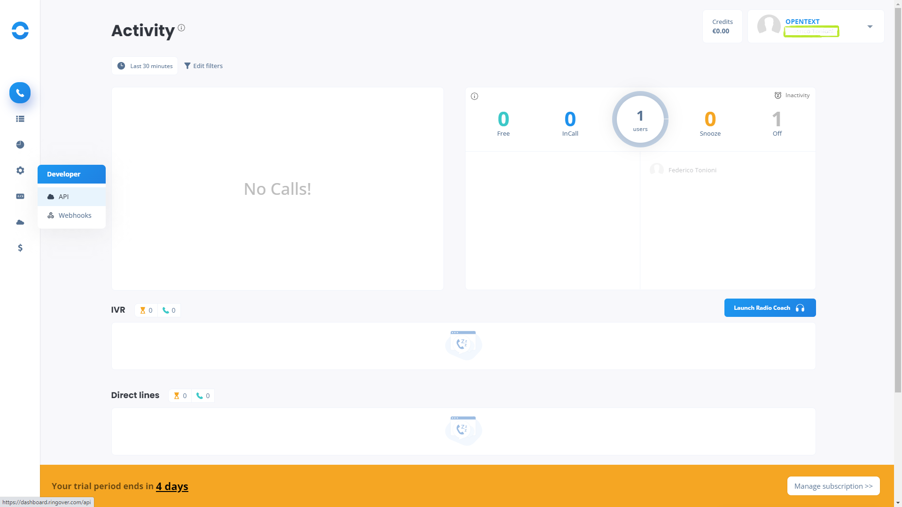
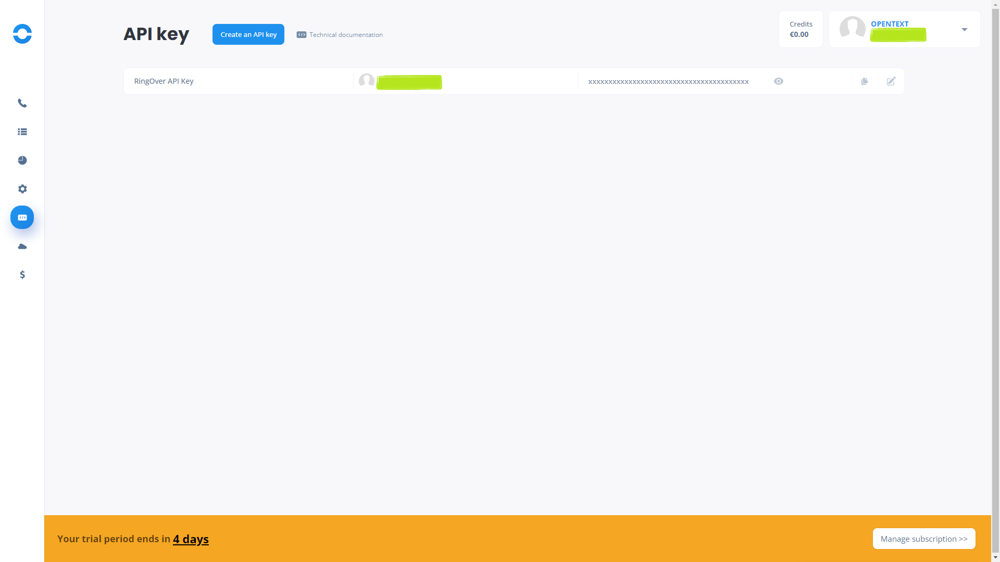
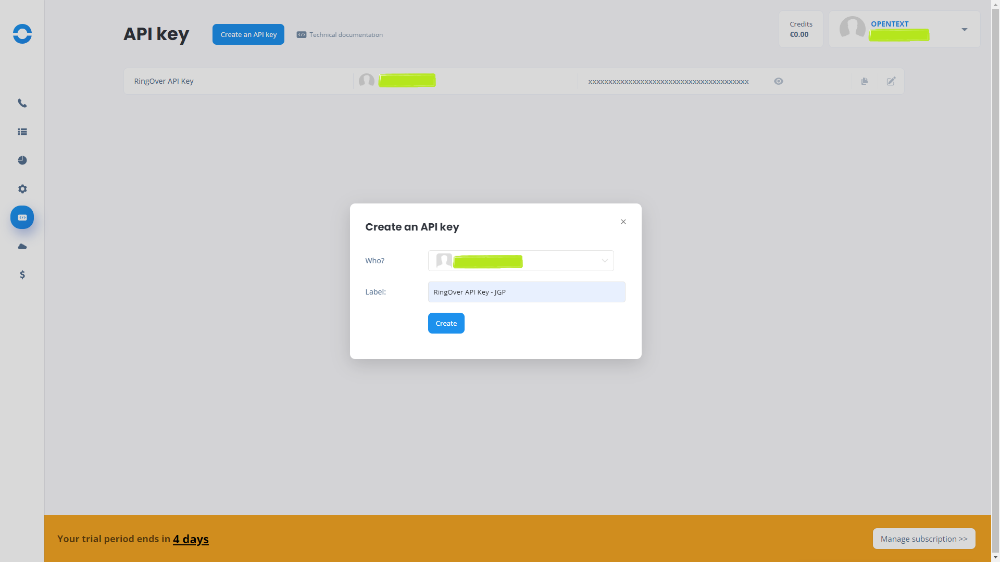
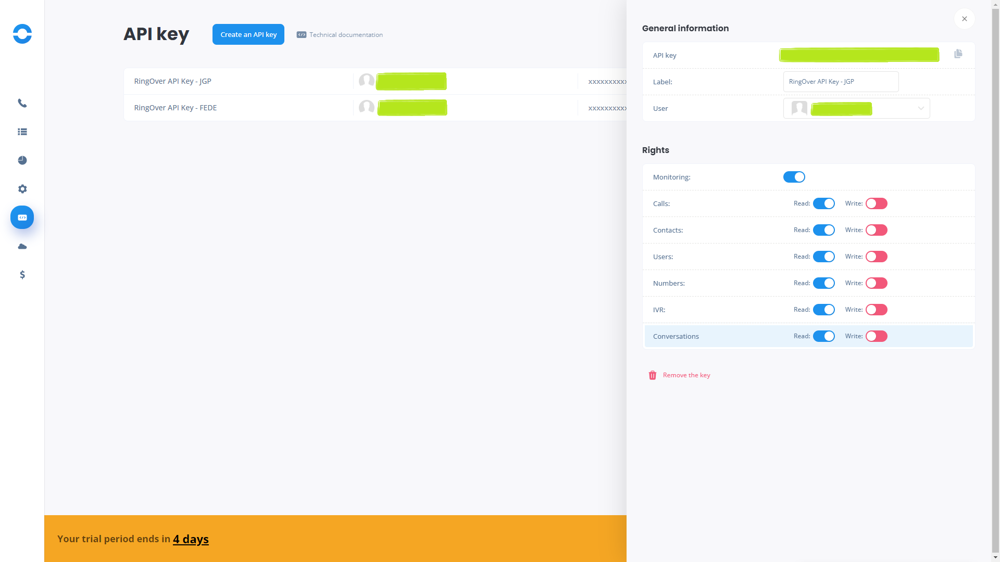

# Ringover2QfinitiDataImporter

Command line tool to download calls from `Ringover` and generate an Excel file that can be used as input of `Qfiniti Data Importer`

> **Ringover** is a 100% Cloud voice - video - chat - text and call center solution.

> **OpenText Qfiniti** is a call center workforce management software that helps 
> analyze agent to customer multichannel interactions to improve customer service.

> The `Qfiniti Data Import tool`  is used to import recording transactions from etalk Recorder, 
> older versions of Qfiniti, or a 3rd party recording device into Qfiniti.

## Command line execution

To run this command line tool you just need to execute runable jar, i.e.

```script
java -jar Ringover2QfinitiDataImporter-23.11.jar -from 20230601 -to 20230621 -c ANSWERED
```

### Valid arguments

These are the valid arguments admitted by this tool:
         
 - **-c,--callType <arg>**   (OPTIONAL) Call type. Used to filter certain types of call. Default value `ANSWERED`. Possible values:
    - *ANSWERED*:  filters answered calls. Default value.
    - *MISSED*:    filters missed calls.
    - *OUT*:       filters outgoing calls.
    - *VOICEMAIL*: filters calls ending on voicemail.
 - **-f,--from <arg>**       (OPTIONAL) From date. Format: yyyymmdd. Default value: yesterday
 - **-o,--output <arg>**     (OPTIONAL) Output file name. Default value: calls-yyyyMMdd.xls
 - **-t,--to <arg>**         (OPTIONAL) To date. Format: yyyymmdd. Default value: today
 - **-u,--unc <arg>**        (MADATORY) Universal Naming Convention (UNC) path to store the call recording files, i.e. *\\SERVER\recordings*
 - **-d, --discard**         (OPTIONAL) Discard calls without audio file associated (false by default)
 - **-w, --wav**              (OPTIONAL) Apply .mp3 to .wav conversion (using ffmpeg). 
 
> **NOTE** 'ffmpeg' must be included in the *PATH* when using --wav argument.
> The conversion from .mp3 to .wav will increase the time needed to complete the process.

### Output

In case of success, the tool will generate an Excel file, by default called `calls-yyyyMMdd.xls`, that looks like this:

| Path_Name	        | File_Name                   | Date_Time           | duration	| group_hierarchy | Team_Member_Name  | dnis         | 
|-------------------|-----------------------------|---------------------|-----------|-----------------|-------------------|--------------|
| \\MY-SERVER\calls	| 33600000000-33180800000.mp3 | 23/06/2023 09:50:42 | 22        | 9161459         | Doe, Joe          |	346789456123 |

 This file can be used as input of `Qfiniti Data Import tool` in order to ingest the calls into **OpenText Explore**.
 
## Ringover API Key

Ringover use API keys for authentication to authorize API requests. 

### Generate a Ringover API key

First, you need to create a public access token (API key) and select the appropriate rights for each user. To do so:

 - Open the [Ringover Dashboard](https://dashboard.ringover.com/).
 - Click on `Developer > API`
 
   
   
 - Click on `Create an API key` button

    
   
 - Select a user in the drop-down menu and enter a label for the key and click the Create button.
    
   
   
 - Click the Edit button corresponding to the API key and select the appropriate rights:
    - Enable `Monitoring`
    - Enable `Calls` Read permission
    - Enable `Contacts` Read permission
    - Enable `Users` Read permission
    - Enable `Numbers` Read permission
    - Enable `Monitoring` Read permission
    - Enable `IVR` Read permission
    - Enable `Conversations` Read permission
                             
      

### ringover.properties

You need to update the file `ringover.properties` located at `PROJECT-FOLDER\lib\src\main\resources` with your Ringover API key.
The file looks like this:

```
apiKey=RINGOVER_API_KEY
```

## Versions

### 23.10 change log

 - Released on October 18th, 2023
 - Initial version

### 23.11 change log

 - Released on October 25th, 2023
 - Added new parameter **--wav**